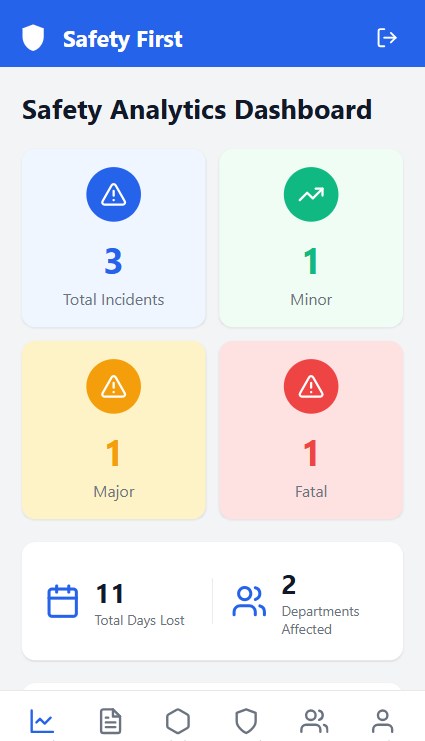
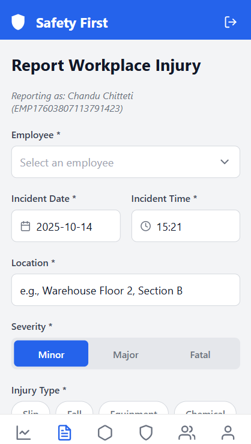
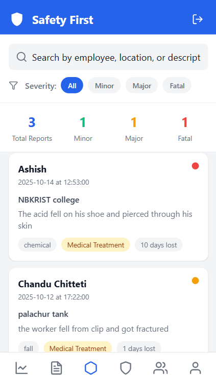
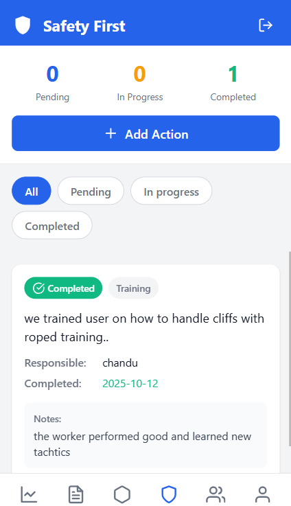
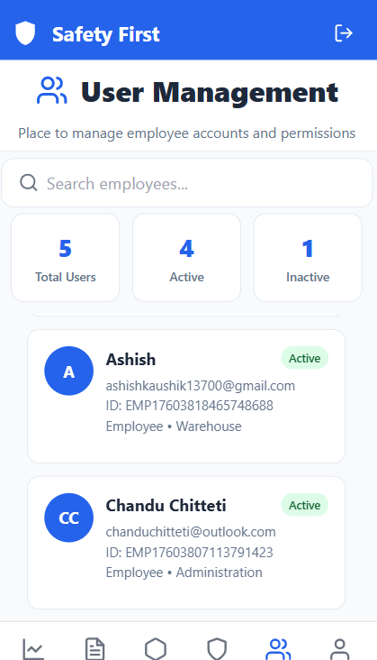
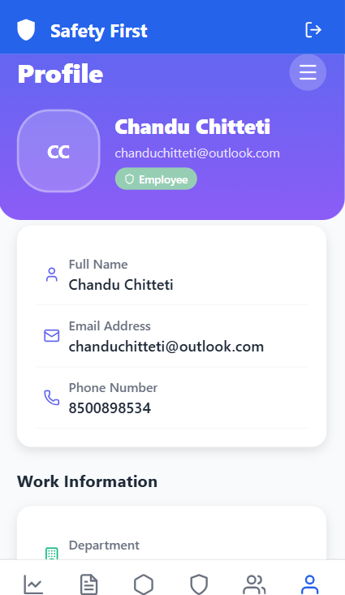
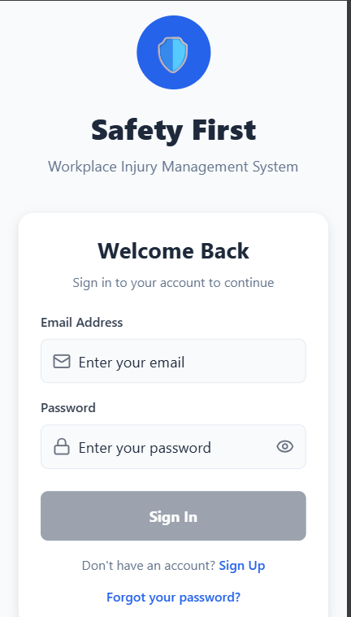
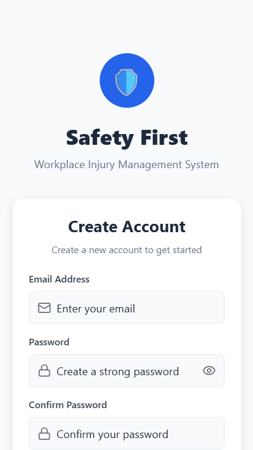

# Safety First - Injury Management 🚑

A comprehensive mobile application built with Expo and Supabase to streamline the process of reporting, tracking, and preventing workplace injuries. This app empowers employees to quickly report incidents, allows administrators to analyze injury data, and facilitates the implementation of preventive measures to create a safer work environment.

## 🚀 Key Features

- **Incident Reporting:**  Employees can easily submit detailed injury reports with information on the incident date, time, location, description, severity, and more.
- **User Authentication:** Secure user authentication system with login, signup, and password reset functionalities powered by Supabase Auth.
- **Role-Based Access Control:**  Different user roles (e.g., employee, administrator) can have different levels of access to the application's features.
- **Data Visualization:**  Interactive dashboards and charts provide insights into injury trends, helping identify areas for improvement.
- **Preventive Action Tracking:**  Administrators can create and track preventive actions to address the root causes of injuries and prevent future incidents.
- **Department Management:** Manage departments within the organization, associating employees and injury reports with specific departments.
- **Employee Management:**  Maintain a directory of employees with relevant information such as contact details, job titles, and department assignments.
- **Deep Linking:** Supports deep linking for password reset flows.
- **Offline Support:** (Potentially) Access and manage data even without an internet connection.
- **Cross-Platform Compatibility:** Built with Expo, ensuring compatibility across iOS, Android, and web platforms.

## 🛠️ Tech Stack

*   **Frontend:**
    *   React Native
    *   Expo
*   **Backend:**
    *   Supabase (Authentication, Database)
    *   PostgreSQL
*   **Languages:**
    *   TypeScript
    *   SQL
*   **Development Tools:**
    *   Node.js
    *   npm / yarn
    *   Expo CLI
    *   TypeScript Compiler
    *   Babel
*   **Other:**
    *   app.json (Expo configuration)
    *   tsconfig.json (TypeScript configuration)

## 📦 Getting Started / Setup Instructions

### Prerequisites

1.  **Node.js:** Ensure you have Node.js (version >= 16) installed. You can download it from [nodejs.org](https://nodejs.org/).
2.  **npm or yarn:**  npm comes with Node.js. Yarn is an alternative package manager: `npm install -g yarn`
3.  **Expo CLI:** Install the Expo command-line interface globally: `npm install -g expo-cli` or `yarn global add expo-cli`
4.  **Supabase Account:** You'll need a Supabase account and project. Sign up at [supabase.com](https://supabase.com) and create a new project.
5.  **Expo Go (Mobile):** Install the Expo Go app on your iOS or Android device for testing.
6.  **Android Studio/Xcode (Optional):** If you plan to build native binaries, you'll need Android Studio (for Android) or Xcode (for iOS).

### Installation

1.  **Clone the repository:**

    ```bash
    git clone <repository_url>
    cd <project_directory>
    ```

2.  **Install dependencies:**

    ```bash
    npm install
    # or
    yarn install
    ```

3.  **Configure environment variables:**

    *   Create a `.env` file in the root directory.
    *   Add the following environment variables, replacing the placeholders with your Supabase project credentials:

        ```
        SUPABASE_URL=<your_supabase_url>
        SUPABASE_ANON_KEY=<your_supabase_anon_key>
        RESET_PASSWORD_REDIRECT="exp://127.0.0.1:8081/--/reset-password"
        AUTH_CALLBACK_REDIRECT="exp://127.0.0.1:8081/--/auth-callback"
        ```

        *Note: The `RESET_PASSWORD_REDIRECT` and `AUTH_CALLBACK_REDIRECT` URLs are example values for local development. Adjust them according to your Expo development URL.*

4.  **Initialize Supabase database:**

    *   Navigate to your Supabase project dashboard.
    *   Run the SQL script located at `supabase/migrations/20251010055805_create_injury_tracking_tables.sql` to create the necessary database tables.  You can use the Supabase SQL editor to run the script.

### Running Locally

1.  **Start the Expo development server:**

    ```bash
    npm run dev
    # or
    yarn dev
    ```

2.  **Scan the QR code:**

    *   Use the Expo Go app on your mobile device to scan the QR code displayed in the terminal or Expo DevTools.

3.  **Access on Web:**
    *   The app can also be run on the web using the command `npm run web` or `yarn web`.

## 📂 Project Structure

```
Safety-First-Injury-Management/
├── app/
│   ├── (auth)/
│   │   ├── _layout.tsx
│   │   ├── login.tsx
│   │   └── ...
│   ├── (tabs)/
│   │   ├── _layout.tsx
│   │   ├── injuries.tsx
│   │   └── ...
│   ├── _layout.tsx
│   ├── auth-callback.tsx
│   └── index.tsx
├── components/
│   └── ProtectedRoute.tsx
├── lib/
│   ├── auth-context.tsx
│   └── supabase.ts
├── supabase/
│   └── migrations/
│       └── 20251010055805_create_injury_tracking_tables.sql
├── types/
│   └── global.d.ts
├── app.json
├── package.json
├── tsconfig.json
└── ...
```

## 📸 Screenshots

Here are some snapshots of the application UI:

### Dashboard View


### ReportInjury Submission form


### Injury Analytics


### PreventiveActions Analytics


### User Management page


### Profile of User


### Login Page


### signup page



## 🤝 Contributing

Contributions are welcome! Please follow these steps:

1.  Fork the repository.
2.  Create a new branch for your feature or bug fix.
3.  Make your changes and commit them with descriptive messages.
4.  Submit a pull request.

## 📝 License

This project is licensed under the [MIT License](LICENSE).

## 📬 Contact

For questions or inquiries, please contact me via linkedin.

💖 Thanks for checking out Safety First - Injury Management! We hope it helps you create a safer workplace.

